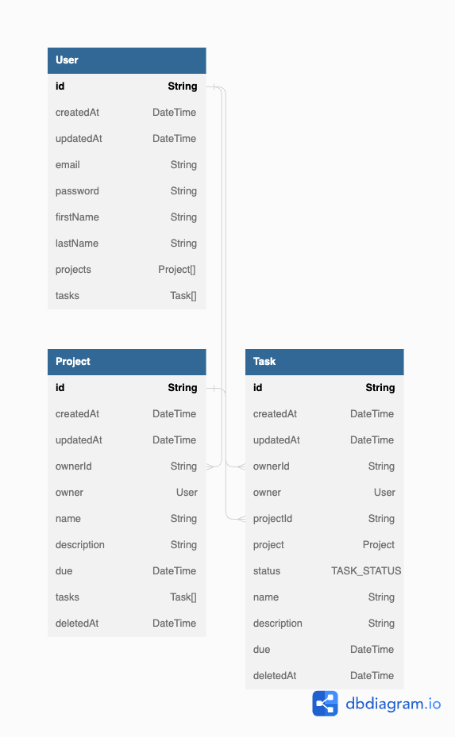

# Project Managed app

* live demo <a href="https://tiny-post-app.vercel.app/" target="_blank" rel="noopener">here</a>

## Introduction

A full stack project management app built with Next.js, Typescript and Sass.

## 🗝️ Features

* Built with Next.js 13's new feature "app" directory
* Auth
  * User can sign in/register using their email address and password
    * Password gets hashed/compared using bcrypt library
    * Use JWT to authorise user
    * Use edge runtime to save and access cookies with middleware
* Dashboard 
  * User can check their projects
  * User is directed to project's detail page when clicking the project card.
    * User can create new task
    * User can click each task to see details and edit/delete task
    * User can delete the project
  * User can check their tasks by status in status page
* Use Sass modules throuout the app
* Use Sass mixins and variables for reusable styles
* Completely responsive 🙌(Mobile first approach)

## 📀 Database Schema

## 📸 Screenshots

## 🛠️ Tech Stack

## Dependencies
* Prisma
* Bcrypt
* React-feather
* Jose
## 🔜 Future Challenge
- [ ] Add User Profile page & Settings page
- [ ] Style Status page's task cards