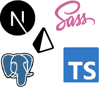

# Project Managed app

* !!! Work In Progress
* live demo <a href="https://project-managed-app.vercel.app/" target="_blank" rel="noopener">here</a>

To log in as a guest: 

email: user@email.com
password: password

## Introduction

A full stack project management app built with Next.js, Typescript and Sass.

## 🗝️ Features

* Built with Next.js 13's new feature "app" directory
* Auth
  * User can sign in/register using their email address and password
    * Hash and compare passwords using bcrypt
    * Use JWT to user authorization
    * Utilize middleware in the edge runtime to save and access cookies for session management
* Dashboard 
  * User can check their projects
  * User is directed to project's detail page when clicking the project card
    * User can create new task
    * User can click each task to see details and edit/delete task
    * User can delete the project
  * User can check their tasks by status in status page
* Use Sass modules throuout the app
* Use Sass mixins and variables for reusable styles
* Completely responsive 🙌(Mobile first approach)

## 🔍 Why I chose what I chose ?
1. Next.js
  * Allows building and deploying full-stack apps without separate server-side code.
2. TypeScript
  * Enables writing more precise code with enhanced type checking.
  * Provides better error handling and auto completion, which benefits code quality and developer productivity.
3. SCSS(Sass)
  * Provides advanced CSS features like mixins and functions for easy style control and manipulation.
  * Offers a powerful CSS writing experience.
4. Prisma
  * Simplifies database setup with its existing schema.
  * Has easy integration and management of database.
5. JWT with edge runtime's cookies
  * Allows more specific control over session management.
  * Uses industry-standard authentication mechanism which is compatible with many frameworks.
  * Learning opportunity - I wanted to gain a deeper understanding of the underlying authentication mechanisms and security concepts.
  * Offers full controll over token generation, validation, and expiration.
6. Middleware
  * Enables intercepting and processing requests in a centralized manner.
  * Retrieve, validates and verifies JWT

  
## 📀 Database Schema

## 📸 Screenshots

## 🛠️ Tech Stack

## Dependencies
* Prisma
* Bcrypt
* React-feather
* Jose
## 🔜 Future Challenge
- [ ] Add User Profile page & Settings page
- [ ] Style Status page's task cards